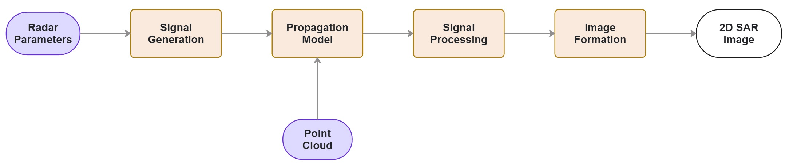

# Ray Tracing-Assisted Spotlight SAR for UAVs in Reflective Environments
Master's Thesis on Ray Tracing-Assisted Spotlight SAR for UAVs in Reflective Environments - Assessing the Influence of Pose Stability on Image Formation

## About The Project

This is a Mechatronics master's thesis study, done in collaboration with KTH Royal Institute of Technology and AFRY AB in Stockholm, Sweden. The study is an experimental, simulation-based investigation of how altitude and range disturbances affect image formation in low-altitude UAV-based SAR image formation. The SAR signal simulation is integrated with a Ray Tracing-based propagation model using SBR. The simulation takes a .osm map to create a point cloud of the target scene, generates an LFM pulse and uses the propagation model to track the radio waves and calculate the received signal characteristics. The image formation method used is RMA. Below is an overview of the simulation design. 



## Prerequisites

To run the simulation in MATLAB, you need the following MATLAB toolboxes:
1. Antenna Toolbox
2. Image Processing Toolbox 
3. Phased Array System Toolbox

The simulation has been testsed mainly on MATLAB version R2024b, which supports Windows, macOS and Linux. 

## Installation 

1. Clone the repo

 ```sh
   git clone https://github.com/alexejnervall/Ray-Tracing-Assisted-Spotlight-SAR-for-UAVs-in-Reflective-Environments.git
   ```
2. Main script ready to run in MATLAB

## Usage

The simulation environment functions as a flexible testbed where users can explore and modify radar parameters, propagation model settings, scene configurations and disturbance models to investigate how these factors influence the final SAR image formation.

## License

This project is open source and available under the MIT License. You are free to use, modify, and distribute this software for any purpose, including commercial applications, provided that the original license notice is included. See `LICENSE.txt` for more information.
